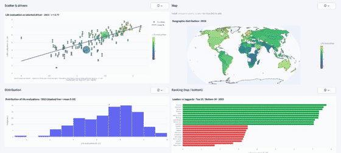
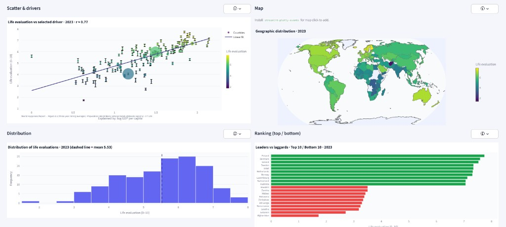

# World Happiness Report — Interactive Dashboard

[](https://github.com/Guille1799/-World-Happiness-Report-Dashboard/actions/workflows/ci.yml)
[](LICENSE)
[](https://streamlit.io)
[](https://www.python.org/downloads/)

Exploratory analytics UI for **national life evaluations** (Cantril ladder, 0–10) and WHR-style drivers: **Plotly** maps, scatter plots, distributions, multi-country **trends**, CSV export, and **EN/ES** UI strings.  
**Live app:** [world-happiness-report-dash.streamlit.app](https://world-happiness-report-dash.streamlit.app/)

### Case study (short)

Researchers, students, and journalists often need to **compare countries over time** and **see drivers of life evaluation** without spinning up a notebook for every question. This dashboard turns WHR-style tabular data into **linked views** (scatter, map, trends, exports) with **EN/ES** labels so a single deployment can support presentations and self-serve exploration. It is intentionally **dependency-light** for Streamlit Cloud while still allowing optional map click-to-add when `streamlit-plotly-events` is installed.

### Screenshots

<p align="center">
  <a href="https://world-happiness-report-dash.streamlit.app/">
    
  </a>
</p>

<p align="center">
  <a href="https://world-happiness-report-dash.streamlit.app/">
    
  </a>
</p>

*Cross-section view: scatter & drivers, geographic distribution, histogram, top/bottom ranking. The GIF above is a subtle zoom loop from the static screenshot; **[open the live app](https://world-happiness-report-dash.streamlit.app/)** for trends, exports, and EN/ES UI.*

This repository is a **monorepo**:

| Path | Purpose |
|------|---------|
| [`world-happiness-streamlit/`](world-happiness-streamlit/) | Main **Streamlit** application (`app.py`), tests, Docker, pinned `requirements.txt`. |
| [`shiny-dashboard-redirect/`](shiny-dashboard-redirect/) | Minimal **R/Shiny** app that **redirects** a legacy [shinyapps.io](https://www.shinyapps.io/) URL to the Streamlit deployment. |

---

## Features (Streamlit app)

- **Cross-section:** scatter (driver vs life evaluation), world choropleth, histogram, top/bottom bars, KPIs, automated insight bullets, optional **confidence intervals** when the WHR workbook provides whiskers.
- **Trends:** up to eight countries, year-window zoom, presets (regional groups + data-driven rankings), summary table with coverage / missing-year stats, shareable **query parameters** (`year`, `t0`, `t1`, `c`).
- **UX:** info popovers, safe linear fits when `numpy` SVD fails, graceful **offline** handling for optional World Bank population CSV.
- **i18n:** English and Spanish for major labels and help text.

---

## Tech stack

- Python **3.11+**, **Streamlit**, **Plotly**, **pandas**, **numpy**  
- Optional: **country_converter**, **streamlit-plotly-events** (map click-to-add)  
- Tests: **pytest** (`world-happiness-streamlit/tests/`)

---

## Quick start (local)

```bash
cd world-happiness-streamlit
python -m venv .venv
# Windows:
.venv\Scripts\activate
# macOS/Linux:
# source .venv/bin/activate

pip install -r requirements.txt
streamlit run app.py
```

**Developer install (includes pytest):**

```bash
pip install -r requirements-dev.txt
python -m pytest tests/ -q
```

Copy [`.env.example`](.env.example) to `.env` only on your machine if you need paths or flags — **never commit `.env`**.

---

## Deploy — Streamlit Community Cloud

1. Push this repo to GitHub.
2. Open [share.streamlit.io](https://share.streamlit.io) and sign in with GitHub.
3. **New app** → select the repo, branch **`main`**, main file **`world-happiness-streamlit/app.py`**.
4. **Dependencies:** Streamlit Cloud installs the **root** [`requirements.txt`](requirements.txt), which includes [`world-happiness-streamlit/requirements.txt`](world-happiness-streamlit/requirements.txt) (Plotly, NumPy, etc.). Do not remove that `-r` line or the app will fail on `import plotly`.
5. **Python version (important):** On deploy, open **Advanced settings** and choose **Python 3.12** or **3.11**. This project’s pins match those runtimes. If the platform picks **Python 3.14+**, installs can take ages or fail (missing wheels; source builds). **You cannot change Python after deploy** — you must [delete the app and redeploy](https://docs.streamlit.io/deploy/streamlit-community-cloud/manage-your-app/upgrade-python) and pick **3.12** or **3.11** again under **Advanced settings**.
6. Add **Secrets** only if you use private data paths (same keys as `.env.example`).

**If the app stays on “Your app is in the oven” for more than ~5–10 minutes:** open **Manage app** (lower right) → **Logs** and check whether the build failed or is still installing. Try **Reboot app** (or **⋮ → Reboot**). If it still hangs, cancel the deploy and redeploy after a push; see [Streamlit status](https://www.streamlitstatus.com/) if outages are reported. The root [`requirements.txt`](requirements.txt) is kept minimal (only the dashboard `-r` file) so installs finish faster.

---

## Legacy Shiny URL → Streamlit

If you still serve an old link on **shinyapps.io**, deploy the tiny app in [`shiny-dashboard-redirect/`](shiny-dashboard-redirect/) so it redirects to your Streamlit URL.  
Step-by-step: [`shiny-dashboard-redirect/DEPLOY-SHINY.md`](shiny-dashboard-redirect/DEPLOY-SHINY.md).

---

## Repository layout

```
world-happiness-streamlit/
  app.py              # Entry point
  i18n.py             # EN/ES strings
  insights.py         # Automated bullets + safe_pearson_r
  trend_helpers.py    # Presets, rankings, summary table
  tests/              # pytest
  data/demo_whr.csv   # Small demo dataset (committed)
shiny-dashboard-redirect/
  app.R               # Redirect target URL (Streamlit production)
scripts/
  make_demo_gif.py    # Regenerate docs/images/demo.gif (needs Pillow)
  push-to-github.ps1  # Optional: git remote + push (Windows)
```

---

## Contributing

See [CONTRIBUTING.md](CONTRIBUTING.md).

---

## Security

Do not commit secrets. Report sensitive issues responsibly — see [SECURITY.md](SECURITY.md).

---

## License & data attribution

- **Code:** [MIT License](LICENSE).
- **Data:** [World Happiness Report](https://worldhappiness.report/) and **Gallup World Poll** data are subject to their terms. This project is **not** affiliated with the WHR, SDSN, or Gallup. World Bank–style population merge uses public registry data when online; a local CSV can be used offline.

---

## Roadmap (ideas to level up the project)

High impact, roughly ordered:

| Priority | Idea |
|----------|------|
| ✓ | **CI** — GitHub Actions: **Ruff**, pytest + **coverage** (≥ 95% on `trend_helpers` / `insights`), `py_compile`. |
| ✓ | **Lint** — `ruff` + `pyproject.toml` in `world-happiness-streamlit/`. |
| ✓ | **Docs** — PNG in `docs/images/`, optional GIF note in README. |
| ✓ | **pre-commit** — `.pre-commit-config.yaml` (Ruff + pytest when app code changes). |
| ✓ | **Theming** — `.streamlit/config.toml` (light default; dark via app **Settings → Appearance**). |
| ✓ | **Issues** — templates under `.github/ISSUE_TEMPLATE/`. |
| | **Accessibility** — keyboard focus, ARIA labels on custom HTML fragments. |
| | **Performance** — cache tuning, lazy imports for cold start on Streamlit Cloud. |
| | **API** — thin FastAPI export of summary stats (optional separate service). |

Contributions welcome — open an issue or PR.
